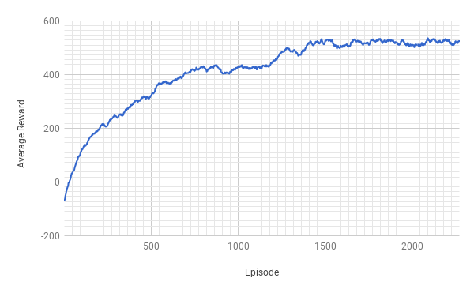

# The MAME RL Algorithm Training Toolkit

## About
This Python library has the to potential to train your reinforcement learning algorithm on almost any arcade game. It is currently available on Linux systems and works as a wrapper around [MAME](http://mamedev.org/). The toolkit allows your algorithm to step through gameplay while recieving the frame data and internal memory address values for tracking the games state, along with sending actions to interact with the game.

## Installation
You can use `pip` to install the library, just run:
```bash
pip install MAMEToolkit
```

**DISCLAIMER: We are unable to provide you with any game ROMs. It is the users own legal responsibility to acquire a game ROM for emulation. This library should only be used for non-commercial research purposes.**

## Street Fighter Random Agent Demo
The toolkit has currently been applied to Street Fighter III Third Strike: Fight for the Future (Japan 990608, NO CD), but can modified for any game available on MAME. The following demonstrates how a random agent can be written for a street fighter environment.
```python
import random
from MAMEToolkit.sf_environment import Environment

roms_path = "roms/"
env = Environment("env1", roms_path)
env.start()
while True:
    move_action = random.randint(0, 8)
    attack_action = random.randint(0, 9)
    frames, reward, round_done, stage_done, game_done = env.step(move_action, attack_action)
    if game_done:
        env.new_game()
    elif stage_done:
        env.next_stage()
    elif round_done:
        env.next_round()
```

The toolkit also supports hogwild training:
```Python
from threading import Thread
import random
from MAMEToolkit.sf_environment import Environment


def run_env(env):
    env.start()
    while True:
        move_action = random.randint(0, 8)
        attack_action = random.randint(0, 9)
        frames, reward, round_done, stage_done, game_done = env.step(move_action, attack_action)
        if game_done:
            env.new_game()
        elif stage_done:
            env.next_stage()
        elif round_done:
            env.next_round()


def main():
    workers = 8
    # Environments must be created outside of the threads
    roms_path = "roms/"
    envs = [Environment(f"env{i}", roms_path) for i in range(workers)]
    threads = [Thread(target=run_env, args=(envs[i], )) for i in range(workers)]
    [thread.start() for thread in threads]
```


## Setting Up Your Own Game Environment
It doesn't take much to interact with the emulator itself using the toolkit, however the challenge comes from finding the memory address values associated with the internal state you care about, and tracking said state with your environment class.
The internal memory states of a game can be tracked using the [MAME Cheat Debugger](http://docs.mamedev.org/debugger/cheats.html), which allows you to track how the memory address values of the game change over time.
To create an emulation of the game you must first have the ROM for the game you are emulating and know the game ID used by MAME, for example for this version of street fighter it is 'sfiii3n'. 

**Game ID's**<br>
The id of your game can be found by running:
```python
from MAMEToolkit.emulator import Emulator
emulator = Emulator("env1", "", "", memory_addresses)
```
This will bring up the MAME emulator. You can search through the list of games to find the one you want. The id of the game is always in brackets at the end of the game title.

**Memory Addresses**<br>
Once you have these and have determined the memory addresses you wish to track you can start the emulation:
```python
from MAMEToolkit.emulator import Emulator
from MAMEToolkit.emulator import Address

roms_path = "roms/"
game_id = "sfiii3n"
memory_addresses = {
        "fighting": Address('0x0200EE44', 'u8'),
        "winsP1": Address('0x02011383', 'u8'),
        "winsP2": Address('0x02011385', 'u8'),
        "healthP1": Address('0x02068D0B', 's8'),
        "healthP2": Address('0x020691A3', 's8')
    }
    
emulator = Emulator("env1", roms_path, "sfiii3n", memory_addresses)
```
This will immediately start the emulation and halt it when it toolkit has linked to the emulator process. 

**Stepping the emulator**<br>
Once the toolkit is linked, you can step the emulator along using the step function:
```python
data = emulator.step([])

frame = data["frame"]
is_fighting = data["fighting"]
player1_wins = data["winsP1"]
player2_wins = data["winsP2"]
player1_health = data["healthP1"]
player2_health = data["healthP2"]
```
The step function returns the frame data as a NumPy matrix, along with all of the memory address integer values from that timestep.

**Sending inputs**
To send actions to the emulator you also need to determine which input ports and fields the game supports. For example, with street fighter to insert a coin the following code is required:
```python
from MAMEToolkit.emulator import Action

insert_coin = Action(':INPUTS', 'Coin 1')
data = emulator.step([insert_coin])
```
To identify which ports are availble use the list actions command:
```python
from MAMEToolkit.emulator import list_actions

roms_path = "roms/"
game_id = "sfiii3n"
print(list_actions(roms_path, game_id))
```
which for street fighter returns the list with all the ports and fields available for sending actions to the step function:
```python
[
    {'port': ':scsi:1:cdrom:SCSI_ID', 'field': 'SCSI ID'}, 
    {'port': ':INPUTS', 'field': 'P2 Jab Punch'}, 
    {'port': ':INPUTS', 'field': 'P1 Left'}, 
    {'port': ':INPUTS', 'field': 'P2 Fierce Punch'}, 
    {'port': ':INPUTS', 'field': 'P1 Down'}, 
    {'port': ':INPUTS', 'field': 'P2 Down'}, 
    {'port': ':INPUTS', 'field': 'P2 Roundhouse Kick'}, 
    {'port': ':INPUTS', 'field': 'P2 Strong Punch'}, 
    {'port': ':INPUTS', 'field': 'P1 Strong Punch'}, 
    {'port': ':INPUTS', 'field': '2 Players Start'}, 
    {'port': ':INPUTS', 'field': 'Coin 1'}, 
    {'port': ':INPUTS', 'field': '1 Player Start'}, 
    {'port': ':INPUTS', 'field': 'P2 Right'}, 
    {'port': ':INPUTS', 'field': 'Service 1'}, 
    {'port': ':INPUTS', 'field': 'Coin 2'}, 
    {'port': ':INPUTS', 'field': 'P1 Jab Punch'}, 
    {'port': ':INPUTS', 'field': 'P2 Up'}, 
    {'port': ':INPUTS', 'field': 'P1 Up'}, 
    {'port': ':INPUTS', 'field': 'P1 Right'}, 
    {'port': ':INPUTS', 'field': 'Service Mode'}, 
    {'port': ':INPUTS', 'field': 'P1 Fierce Punch'}, 
    {'port': ':INPUTS', 'field': 'P2 Left'}, 
    {'port': ':EXTRA', 'field': 'P2 Short Kick'}, 
    {'port': ':EXTRA', 'field': 'P2 Forward Kick'}, 
    {'port': ':EXTRA', 'field': 'P1 Forward Kick'}, 
    {'port': ':EXTRA', 'field': 'P1 Roundhouse Kick'}, 
    {'port': ':EXTRA', 'field': 'P1 Short Kick'}
]
```
We advise you to create an enum of all the possible actions, then send their action values to the emulator, see [the example Actions Enum](https://github.com/BombayCinema/MAMEToolkit/blob/master/Actions.py)

There is also the problem of transitioning games between non-learnable gameplay screens such as the title screen and character select. To see how this can be implemented please look at the provided [Steps script](https://github.com/BombayCinema/MAMEToolkit/blob/master/Steps.py) and the [Example Street Fighter III Third Strike: Fight for the Future Environment Implementation](https://github.com/BombayCinema/MAMEToolkit/blob/master/Environment.py)

The emulator class also has a frame_ratio argument which can be used for adjusting the frame rate seen by your algorithm. By default MAME generates frames at 60 frames per second, however, this may be too many frames for your algorithm. The toolkit by default will use a frame_ratio of 3, which means that 1 in 3 frames are sent through the toolkit, this converts the frame rate to 20 frames per second. Using a higher frame_ratio also increases the performance of the toolkit.
```Python
from MAMEToolkit.emulator import Emulator

emulator = Emulator(roms_path, game_id, memory_addresses, frame_ratio=3)
```

## Library Performance Benchmarks with PC Specs
The development and testing of this toolkit have been completed on an 8-core AMD FX-8300 3.3GHz CPU along with a 3GB GeForce GTX 1060 GPU.
With a single random agent, the street fighter environment can be run at 600%+ the normal gameplay speed. And For hogwild training with 8 random agents, the environment can be run at 300%+ the normal gameplay speed.

## Simple ConvNet Agent
To ensure that the toolkit is able to train algorithms, a simple 5 layer ConvNet was setup with minimal tuning. The algorithm was able to successfully learn some simple mechanics of Street Fighter, such as combos and blocking. The Street Fighter gameplay works by having the player fight different opponents across 10 stages of increasing difficulty. Initially, the algorithm would reach stage 2 on average, but eventually could reach stage 5 on average after 2200 episodes of training. The learning rate was tracked using the net damage done vs damage taken of a single playthough for each episode.




